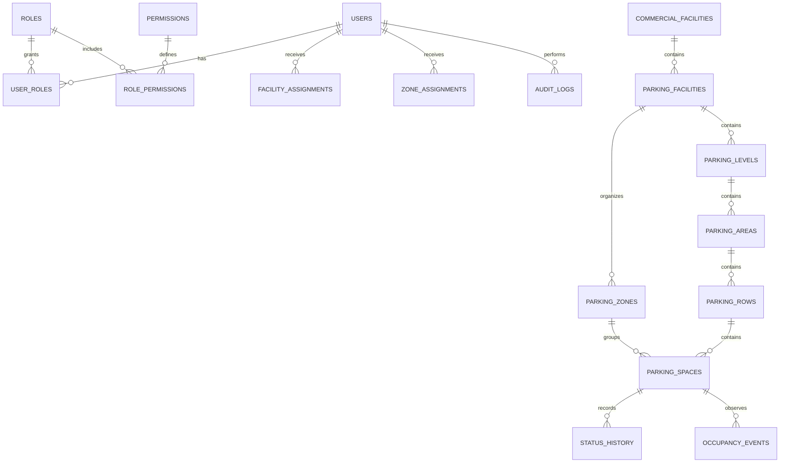

# osm-map-app Relational Schema Specification

## 1. Purpose and Conventions

This document defines the logical PostgreSQL schema for the first backend release. It is a design specification, not an executable migration. Implementation must use versioned SQL migrations and parameterized raw SQL; no ORM models or generated schema are implied.

### 1.1 Common conventions

- Primary keys use `uuid`.
- Foreign keys use the referenced table's `uuid` type.
- API timestamps map to PostgreSQL `timestamptz` and are stored in UTC.
- Mutable records include `created_at`, `updated_at`, and `version integer not null default 1`.
- Soft-deletable records use nullable `deleted_at timestamptz`.
- Text identifiers that are compared case-insensitively are normalized in the service and protected with a database uniqueness constraint.
- Status and type values use PostgreSQL enums only when the value set is stable; lookup tables are preferred when values require metadata or future administration.
- JSONB is reserved for provider payloads and extensible metadata, not relationships or core business fields.

## 2. Logical Relationship Model

A parking space belongs directly to a parking facility and may optionally reference a zone, level, area, and row. The optional lower-level references support partial configuration during onboarding, but a published space must satisfy the hierarchy rules in Section 6.

## 3. Identity and Authorization Schema

### 3.1 `users`

| Column | Type | Rules |
|---|---|---|
| `id` | `uuid` | Primary key |
| `email` | `citext` | Required, unique, normalized |
| `password_hash` | `text` | Required for local accounts; never returned |
| `display_name` | `text` | Required, bounded length |
| `status` | `account_status` | Required; `active`, `pending`, `suspended`, or `closed` |
| `last_login_at` | `timestamptz` | Nullable |
| `created_at` | `timestamptz` | Required |
| `updated_at` | `timestamptz` | Required |
| `version` | `integer` | Required, positive |
| `deleted_at` | `timestamptz` | Nullable |

### 3.2 `roles`, `permissions`, `user_roles`, `role_permissions`

`roles` contains `id`, unique `code`, `name`, and timestamps. Initial role codes are `developer`, `admin`, `parking_manager`, and `driver`.

`permissions` contains `id`, unique `code`, `resource`, `action`, and timestamps. `role_permissions` has a composite primary key `(role_id, permission_id)`. `user_roles` has a composite primary key `(user_id, role_id)` and timestamps.

### 3.3 Scope assignments

`facility_assignments` contains `user_id`, `commercial_facility_id` or `parking_facility_id`, assignment timestamps, and the assigning actor. A row must target exactly one assignment scope; use separate nullable foreign keys plus a check constraint, or separate typed assignment tables.

`zone_assignments` contains `user_id`, `zone_id`, assignment timestamps, and the assigning actor. Scope inheritance is defined in [security-specification.md](security-specification.md): parent facility scope reaches descendants, while a zone scope does not reach siblings or parents.

### 3.4 `refresh_sessions`

| Column | Type | Rules |
|---|---|---|
| `id` | `uuid` | Primary key |
| `user_id` | `uuid` | Foreign key to `users` |
| `token_hash` | `bytea` | Required, unique |
| `family_id` | `uuid` | Required; detects refresh reuse |
| `expires_at` | `timestamptz` | Required |
| `revoked_at` | `timestamptz` | Nullable |
| `replaced_by_session_id` | `uuid` | Nullable self-reference |
| `created_ip` | `inet` | Nullable |
| `user_agent` | `text` | Nullable, bounded |
| `created_at` | `timestamptz` | Required |

Refresh sessions are revoked rather than deleted so reuse and logout events remain auditable.

## 4. Facility and Parking Hierarchy

### 4.1 `commercial_facilities`

Contains `id`, `name`, `description`, `address_line1`, `address_line2`, `city`, `region`, `postal_code`, `country_code`, optional `geometry geometry(Point, 4326)`, `status`, common timestamps, `version`, and `deleted_at`.

### 4.2 `parking_facilities`

Contains `id`, `commercial_facility_id`, `name`, `description`, address fields, `capacity integer`, `default_currency char(3)`, optional `default_hourly_rate_minor integer`, `status`, optional `geometry geometry(Point, 4326)`, common timestamps, `version`, and `deleted_at`.

`capacity` is non-negative. The implementation must either derive capacity from active spaces or update a cached value in the same transaction. It must never be allowed to fall below current occupied spaces.

### 4.3 `parking_zones`

Contains `id`, `parking_facility_id`, `code`, `name`, `description`, `accessibility_metadata jsonb`, optional `geometry geometry(Polygon, 4326)`, common timestamps, `version`, and `deleted_at`.

`(parking_facility_id, code)` is unique among non-deleted rows. Geometry is optional because PAZ is an administrative grouping. When present, it must be valid and use the canonical SRID.

### 4.4 Levels, areas, and rows

Each table has `id`, its required parent foreign key, `code`, `name`, optional `description`, common timestamps, `version`, and `deleted_at`. Codes are unique within their parent among non-deleted rows:

- `parking_levels`: parent `parking_facility_id`.
- `parking_areas`: parent `parking_level_id`.
- `parking_rows`: parent `parking_area_id`.

## 5. Parking Space Schema

### 5.1 `parking_spaces`

| Column | Type | Rules |
|---|---|---|
| `id` | `uuid` | Primary key |
| `parking_facility_id` | `uuid` | Required foreign key |
| `zone_id` | `uuid` | Nullable foreign key in same facility |
| `level_id` | `uuid` | Nullable foreign key in same facility |
| `area_id` | `uuid` | Nullable foreign key through level |
| `row_id` | `uuid` | Nullable foreign key through area |
| `label` | `text` | Required; unique within parking facility |
| `space_type` | `space_type` | Required |
| `status` | `space_status` | Required |
| `requires_permit` | `boolean` | Required, default false |
| `allowed_vehicle_types` | `text[]` | Required, validated against allow-list |
| `hourly_rate_minor` | `integer` | Nullable, non-negative |
| `currency` | `char(3)` | Required when rate is present |
| `geometry` | `geometry(Point, 4326)` | Nullable; canonical map point |
| `metadata` | `jsonb` | Optional non-relational metadata |
| `created_at` | `timestamptz` | Required |
| `updated_at` | `timestamptz` | Required |
| `version` | `integer` | Required, positive |
| `deleted_at` | `timestamptz` | Nullable |

Initial `space_status` values are `available`, `occupied`, `reserved`, `unavailable`, and `maintenance`. Initial `space_type` values are `standard`, `accessible`, `electric`, `motorcycle`, `loading`, and `staff`; the final product vocabulary must be confirmed before migration creation.

### 5.2 Cross-hierarchy integrity

The database must prevent a space from referencing a zone, level, area, or row belonging to another parking facility. This may be enforced with composite foreign keys using stable parent keys or in a transactionally locked service/repository operation backed by constraints. The implementation must choose one enforcement strategy before coding.

A unique partial index enforces `(parking_facility_id, lower(label))` for active spaces. A GiST index supports spatial queries on `geometry`.

## 6. Occupancy and History

### 6.1 `parking_space_status_history`

Contains `id`, `space_id`, `previous_status`, `new_status`, `changed_by_user_id` nullable for system events, `source`, `reason`, `changed_at`, and optional `request_id`. Rows are append-only. No update or delete is available to the application role.

### 6.2 `occupancy_events`

Contains `id`, `space_id`, `source`, optional `external_event_id`, `observed_at`, `received_at`, `previous_status`, `new_status`, optional `payload jsonb`, and processing metadata. A unique constraint on `(source, external_event_id)` applies when the external ID is present.

### 6.3 `occupancy_snapshots`

Contains `id`, aggregation scope type and ID, `bucket_start`, `bucket_size`, `available_count`, `occupied_count`, `reserved_count`, `unavailable_count`, and `created_at`. A unique key prevents duplicate snapshots for the same scope and bucket. Snapshots are derived data and can be rebuilt from retained events where retention allows.

## 7. Spatial Schema Rules

All persisted application geometry uses SRID 4326. API GeoJSON coordinates use `[longitude, latitude]`. The service validates longitude `-180..180`, latitude `-90..90`, geometry validity, and maximum geometry size before persistence.

Use `geography(Point, 4326)` expressions or an explicitly transformed geometry for meter-based `ST_DWithin` searches. Do not mix coordinate order or SRIDs within a query. PostGIS geometry is serialized to GeoJSON at the API boundary.

`gis_features` is reserved for map features that do not belong naturally on a core entity. It contains `id`, `entity_type`, `entity_id`, `feature_type`, `geometry geometry(Geometry, 4326)`, `properties jsonb`, common timestamps, and `deleted_at`. The service owns referential cleanup because `entity_id` may refer to multiple typed tables.

## 8. Audit Schema

### 8.1 `audit_logs`

| Column | Type | Rules |
|---|---|---|
| `id` | `uuid` | Primary key |
| `event_type` | `text` | Required allow-listed event |
| `actor_user_id` | `uuid` | Nullable for anonymous events |
| `target_type` | `text` | Required |
| `target_id` | `uuid` | Nullable for global events |
| `decision` | `text` | `allowed` or `denied` |
| `reason_code` | `text` | Required for denied events |
| `request_id` | `uuid` | Required |
| `source_ip` | `inet` | Nullable |
| `metadata` | `jsonb` | Redacted structured context only |
| `created_at` | `timestamptz` | Required |

Audit records are append-only, access-controlled, and retained according to an approved policy. Secrets, passwords, raw tokens, and unnecessary personal data are prohibited in `metadata`.

## 9. Constraints and Invariants

1. A non-deleted child cannot reference a deleted parent.
2. A parking space label is unique within its active parking facility.
3. Occupied, reserved, and available counts cannot be negative.
4. Capacity cannot be below current occupied count.
5. A status transition must be validated against the current row version inside a transaction.
6. Every accepted occupancy change writes status history, occupancy event, and audit log atomically.
7. Every manager mutation is scoped to the target facility or zone before data is returned or changed.
8. Spatial values use SRID 4326 and canonical GeoJSON coordinate order.
9. Foreign keys and indexes are created before the application depends on the relationship.
10. Historical activity prevents hard deletion of referenced facilities, spaces, users, or zones.

## 10. Migration and Implementation Checklist

Before coding begins, the implementation plan must specify:

- Extension installation and database-owner responsibilities for PostGIS, `pgcrypto`, and optional `citext`.
- Exact enum or lookup-table choices for statuses and types.
- The cross-hierarchy foreign-key strategy.
- Partial indexes for soft-deleted records.
- Migration ordering and rolling-deployment compatibility.
- Seed records and synthetic credentials.
- Transaction boundaries for occupancy and manager updates.
- Retention and archival policy for events and audit logs.
- Query fixtures and `EXPLAIN` checks for nearby and availability queries.
